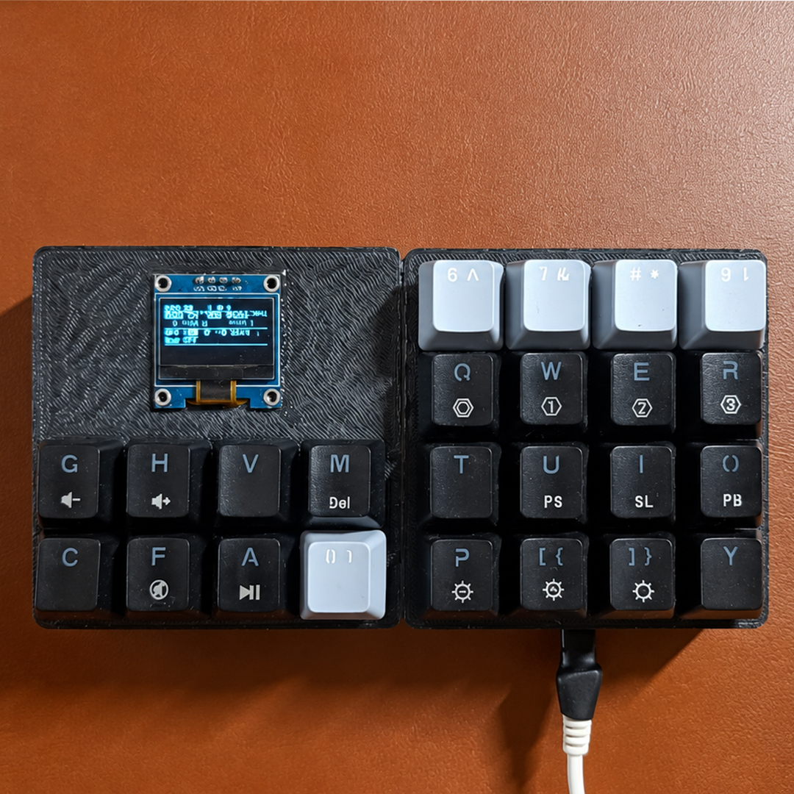

# Grand-Pad 🎹

**Grand-Pad** é um macropad MIDI de 16 pads + 7 botões de controle baseado no Raspberry Pi Pico, com display OLED 128×64, múltiplos modos de play (cromático, acorde, harpejo, generativo, OmniChord), menu de configuração completo e salvamento de presets em flash.

---

## Fotos

| | |
|---|---|
|  |  |

---

## Aviso de Licença e Autoria

Este projeto é distribuído sob a licença **GNU General Public License v3.0 (GPL-3.0)**.  
Consulte o arquivo [`LICENSE`](LICENSE) para os termos completos.

> **Este projeto contou com auxílio de Inteligência Artificial** (Claude, da Anthropic) no desenvolvimento do firmware e na organização dos arquivos do repositório.

Este repositório é um **fork** do projeto original **Macropad MIDI Controller**, de **Nick Culbertson**:  
🔗 https://github.com/NickCulbertson/Macropad-MIDI-Controller

---

## Funcionalidades

- **16 pads** com suporte a múltiplos modos de toque
- **7 botões de controle** (C1–C7) com funções de performance ao vivo
- **Display OLED 128×64** com tela de performance e menu de configuração
- **Modos de play:** Scaled, Cromático, Acorde, Harpejo, Generativo, OmniChord
- **Harpejo:** cada pad dispara um arpejo automático do voicing do acorde, com BPM e divisão configuráveis
- **Sustain touch** (C4): mantém o sustain enquanto o botão estiver pressionado
- **Oitava rápida** (C5/C6): sobe e desce oitava diretamente
- **Botão coringa** (C7): envia CC30 (configurável), 127 ao pressionar e 0 ao soltar — mapeie na DAW para a função que preferir
- **Menu completo** (4 pads simultâneos): escalas, acordes, modos, configuração, presets
- **4 presets** salvos em flash (memória não volátil)
- **Bootsel via GP28**: segurar 2 s entra em modo UF2 para reflash

---

## Mapeamento de Pinos

| GPIO  | Função                        |
|-------|-------------------------------|
| GP0–GP15  | 16 pads                   |
| GP16  | C7 – Botão coringa (CC livre)  |
| GP17  | C6 – Oitava −                 |
| GP18  | C5 – Oitava +                 |
| GP19  | C4 – Sustain touch            |
| GP20  | C3 – Modo Harpejo             |
| GP21  | C2 – Modo Acorde              |
| GP22  | C1 – Modo Cromático           |
| GP25  | LED onboard                   |
| GP26  | OLED SDA (I2C1)               |
| GP27  | OLED SCL (I2C1)               |
| GP28  | Botão BOOTSEL (2 s → UF2)     |

---

## Botões C1–C7 (modo performance)

| Botão | GPIO | Função                              |
|-------|------|-------------------------------------|
| C1    | GP22 | Seleciona modo Cromático            |
| C2    | GP21 | Seleciona modo Acorde               |
| C3    | GP20 | Seleciona modo Harpejo              |
| C4    | GP19 | Sustain touch (hold = on, soltar = off) |
| C5    | GP18 | Oitava +1                           |
| C6    | GP17 | Oitava −1                           |
| C7    | GP16 | Botão coringa (CC 30, hold = 127, release = 0) |

---

## Menu (4 pads do topo simultâneos)

| Botão | Função no menu          |
|-------|-------------------------|
| C1    | Cursor ▲                |
| C2    | Cursor ▼                |
| C3    | Ajuste −                |
| C4    | Ajuste + / Confirmar    |
| C5    | Próxima página          |
| C6    | Fechar menu             |
| C7    | Salvar preset           |

**Páginas:**
1. Escalas (8 opções)
2. Acordes / Voicings (8 opções)
3. Modos de play (6 opções)
4. Config (velocidade, oitava, transpose, canal, root note, sustain fix, BPM/divisão arpejo)
5. Presets (4 slots)

---

## Diagramas de Ligação

Os diagramas de ligação estão disponíveis na pasta [`hardware/wiring/`](hardware/wiring/):

| Arquivo | Descrição |
|---------|-----------|
| [`wiring_full.svg`](hardware/wiring/wiring_full.svg) | Diagrama completo: Pico + pads + botões C1–C7 + OLED |
| [`wiring_pads.svg`](hardware/wiring/wiring_pads.svg) | Detalhe: matriz de 16 pads |
| [`wiring_controls.svg`](hardware/wiring/wiring_controls.svg) | Detalhe: botões C1–C7 e OLED |

---

## Arquivos STL para Impressão 3D

Os arquivos para impressão estão na pasta [`hardware/stl/`](hardware/stl/):

| Arquivo | Descrição |
|---------|-----------|
| [`Grand-Pad.stl`](hardware/stl/Grand-Pad.stl) | Caixa principal do Grand-Pad |

**Configurações sugeridas de impressão:**
- Material: PLA ou PETG
- Espessura de camada: 0,2 mm
- Preenchimento: 20–30%
- Suporte: conforme necessário para a caixa

---

## Dependências (Arduino IDE)

- [Adafruit TinyUSB Library](https://github.com/adafruit/Adafruit_TinyUSB_Arduino)
- [Arduino MIDI Library](https://github.com/FortySevenEffects/arduino_midi_library)
- [Adafruit GFX Library](https://github.com/adafruit/Adafruit-GFX-Library)
- [Adafruit SSD1306](https://github.com/adafruit/Adafruit_SSD1306)
- Board: **Raspberry Pi Pico** via [arduino-pico](https://github.com/earlephilhower/arduino-pico)

**Configuração da placa no Arduino IDE:**
- Board: `Raspberry Pi Pico`
- USB Stack: `Adafruit TinyUSB`
- Flash Size: `2MB (no FS)`

---

## Como Compilar e Gravar

1. Instale o Arduino IDE e o suporte ao RP2040 (earlephilhower/arduino-pico)
2. Instale as dependências listadas acima
3. Abra `firmware/macropad_midi_v2.7/macropad_midi_v2.7.ino`
4. Selecione a placa **Raspberry Pi Pico** e o USB Stack **Adafruit TinyUSB**
5. Pressione **Upload** com o Pico em modo BOOTSEL (segure o botão BOOTSEL ao conectar o USB), ou use o botão GP28 já mapeado no firmware (segurar 2 s)

---

## Histórico de Versões

Veja [`CHANGELOG.md`](CHANGELOG.md) para o histórico detalhado de mudanças
de cada versão do firmware — útil como referência para mensagens de commit.

---

## Créditos

- **Nick Culbertson** — projeto original Macropad MIDI Controller  
  🔗 https://github.com/NickCulbertson/Macropad-MIDI-Controller
- **Grand-Pad** — fork com expansão de funcionalidades, desenvolvido com auxílio de IA (Claude, Anthropic)

---

## Licença

```
Grand-Pad — MIDI Macropad Firmware & Hardware
Copyright (C) 2024  Grand-Pad Contributors

This program is free software: you can redistribute it and/or modify
it under the terms of the GNU General Public License as published by
the Free Software Foundation, either version 3 of the License, or
(at your option) any later version.

This program is distributed in the hope that it will be useful,
but WITHOUT ANY WARRANTY; without even the implied warranty of
MERCHANTABILITY or FITNESS FOR A PARTICULAR PURPOSE. See the
GNU General Public License for more details.

You should have received a copy of the GNU General Public License
along with this program. If not, see <https://www.gnu.org/licenses/>.
```
